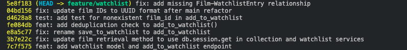

# PR Response Doc — CineLog Watchlist Feature

## AI Usage
I used an AI assistant to stress-test my design reasoning for Comment 4 (Default visibility). After writing my initial draft arguing that watchlist entries were "low-stakes" and therefore fine to make public by default, I asked the AI: "What counterargument would a careful code reviewer raise against this position? What tradeoff am I not acknowledging?" The AI pointed out that media consumption is not always low-stakes and can easily reveal highly sensitive personal information (e.g., identity, politics, mental health). As a result, I revised my "Tradeoff acknowledged" section. Instead of brushing off the privacy concerns, I explicitly acknowledged the risk of unintended disclosure and reframed my argument to acknowledge that we are actively trading "privacy by default" for reduced friction and community growth.

## Comment 1 — Rename
**What I did:**
Renamed the save_to_watchlist() function to add_to_watchlist() in services/watchlist_service.py and updated the corresponding call site in routes/watchlist/watchlist.py

**How I verified:**
Utilized the editor's find-all-references feature and performed a project-wide search for the string save_to_watchlist to confirm that absolutely no residual call sites or imports were missed.

## Comment 2 — Deduplication
**What I did:**
Followed the same pattern as `add_to_collection()` in `services/collection_service.py`: added an `AlreadyInWatchlistError` exception, and in `add_to_watchlist()` (services/watchlist_service.py) added a lookup for an existing `WatchlistEntry` with the same `user_id`/`film_id` before creating a new one, raising `AlreadyInWatchlistError` if one is found instead of inserting a duplicate. Wired the new exception into `POST /watchlist/<user_id>/add` (routes/watchlist/watchlist.py) so it returns a 409 with an error message, matching how `AlreadyInCollectionError` is handled in routes/collection.py.

**How I verified:**
Ran an ad-hoc script against an in-memory SQLite app: called `add_to_watchlist()` twice for the same user/film — the first call succeeded and the second raised `AlreadyInWatchlistError`, with only one `WatchlistEntry` row persisted in the DB. Also hit the route directly via Flask's test client: the first `POST /watchlist/<user_id>/add` returned 201, and the repeat call returned 409 with the expected error body.

## Comment 3 — Missing test
**What I did:**
Created `tests/test_watchlist.py`. Read `tests/test_collection.py` and used `test_add_to_collection_nonexistent_film_raises` as the template, writing the equivalent `test_add_to_watchlist_nonexistent_film_raises` for `add_to_watchlist()`: same `app` fixture (isolated in-memory SQLite app) and `sample_user` fixture, and the same assertion pattern — calling `add_to_watchlist()` with a fake UUID film_id and asserting it raises `FilmNotFoundError` via `pytest.raises`.

**How I verified:**
Ran `pytest tests/test_watchlist.py -v` and confirmed `test_add_to_watchlist_nonexistent_film_raises` passes.

## Comment 4 — Default visibility
**My position:**
I'm keeping `public=True` as the default for `WatchlistEntry.public`.

**Reasoning:**
CineLog's watchlist isn't a private to-do list bolted onto the API — it's the social layer on top of the collection feature: a signal of "here's what I'm planning to watch" that's meant to be seen by other users, not just recorded for yourself. A public-by-default watchlist is what makes features like friend activity feeds, "others who want to watch this" counts on a film's page, or shared watch-party suggestions possible without every user having to take an extra action first. If most users never touch the `public` flag (which is the common case for any optional setting), a `False` default would mean the watchlist quietly becomes a private list for almost everyone, and the social/discovery value the field exists to enable never materializes. Defaulting to public optimizes for the watchlist actually functioning as a discovery mechanism from the moment a user adds their first film, rather than requiring them to opt in to the behavior the feature was built for.

**Tradeoff acknowledged:**
The real cost of public=True is that a "want to watch" entry is disclosed by default, which I recognize is not always low-stakes. Film choices can reveal sensitive personal details regarding identity, politics, or mental health, and a public default risks unintended disclosure if a user assumes privacy and misses the toggle. While defaulting to private is the safer, privacy-respecting choice, I am accepting this tradeoff to enable the core social discovery features of the platform. However, because we are violating strict "privacy by default" principles, this decision accepts the technical debt that the UI must make the public default explicitly clear to the user upon their first watchlist addition.

## Comment 5 — Sort order
**My position:**
I'm keeping `get_watchlist()`'s default order alphabetical (`Film.title.asc()`), not switching to date-added.

**Reasoning:**
A watchlist and a collection are used differently, even though they look similar in the code. `get_collection()` is a log — a record of films you've already watched, where recency genuinely matters because it mirrors a diary: what did I watch most recently. A watchlist is the opposite: it's a backlog you consult *before* deciding what to do next, often much later than when you added anything to it. The real interaction isn't "what did I just add" (that's fresh in the user's head anyway, right after they add it) — it's "is that movie my friend mentioned already on here?" or "let me scan for something to watch tonight." Both of those are lookup-by-name tasks, and alphabetical order is what makes a lookup fast and predictable: a title's position in the list doesn't shift around based on unrelated activity, so a user builds a stable mental map of where things are over weeks or months of using the app. A date-added sort actively works against that — every new addition pushes older entries further down, so the list becomes harder to scan the longer someone uses the feature, which is exactly backwards from what a "watch this later" list should do as it grows.

**Engagement with reviewer's point:**
"Most users want to see what they added recently" is true in a narrow sense — right after adding a film, of course a user wants to see it landed correctly, and either order shows them that in a short list. But that framing only holds for a watchlist that's still small. As it grows into a real backlog (the whole point of a watchlist is to accumulate films for later), recency sorting optimizes for the newest one or two entries at the cost of navigability for everything else — which is most of the list, most of the time. I'd also push back on leaning on `get_collection()`'s convention as justification: consistency across endpoints is a nice-to-have, but it shouldn't override the fact that a watchlist and a collection answer different questions ("what have I done" vs. "what do I want to do"), so it's reasonable for them to sort differently on purpose rather than by default. If usage data later showed people mostly interact with their watchlist right after adding to it (i.e., the backlog theory is wrong for CineLog's actual users), that would change my answer — but absent that evidence, I'd optimize for the list being usable once it's no longer brand new.

## Comment 6 — Rebase
**What conflicted:**
Running `git fetch origin` + `git rebase origin/main` surfaced two problems. First, a textual conflict in `.gitignore`: `main` had a merged PR adding `.venv/`/`venv/` while my branch independently added `.pytest_cache/` — both sides added overlapping-but-different lines to the same section. Second, and more significant: `main` had a commit migrating `Film.id` and `CollectionEntry.film_id` from `db.Integer` to `db.String(36)` (UUID). My branch's `WatchlistEntry` model was created before that refactor existed, so it still declared `film_id = db.Column(db.Integer, db.ForeignKey("film.id"), ...)`. When replaying my commits on top of the new `main`, the `WatchlistEntry` class ended up dropped from `models.py` entirely rather than cleanly merged, since git had no matching context to apply that hunk against.

**How I resolved it:**
For `.gitignore`, I combined both sides manually so `.pytest_cache/`, `.venv/`, and `venv/` are all present, with no duplicate lines and no leftover conflict markers. For the model issue, after the rebase mechanically completed, I re-added the `WatchlistEntry` class to `models.py`, changing `film_id` to `db.Column(db.String(36), db.ForeignKey("film.id"), nullable=False)` to match the new UUID type on `Film.id`, and updated the stale integer references in `services/watchlist_service.py`'s docstring and `routes/watchlist/watchlist.py`'s route comment. This was committed separately as `fix: update film IDs to UUID format after main refactor`.

**How I verified no conflict remains:**
Ran `pytest tests/ -v` after the fix — all 5 tests pass, including `test_add_to_watchlist_nonexistent_film_raises`, confirming `add_to_watchlist()` works correctly against the UUID-based `Film` model. I also confirmed the rebase didn't leave any merge commits of my own: `git log --merges feature/watchlist` only shows `bbe206c`, which is a merge that already existed in `main`'s history before my branch was created (a previously-merged `.gitignore` PR) — not something introduced by my rebase. My own commits sit as a linear sequence on top of `main` with no merges among them, confirmed visually via `git log --oneline --graph`.

## PR Description
<!-- Written at the end — feature overview, design decisions, manual testing steps -->

### What this feature does
Adds a watchlist to CineLog, alongside the existing film collection feature. A watchlist entry represents a film a user wants to watch later, as opposed to a `CollectionEntry`, which represents a film they've already watched and logged.

Two endpoints, mirroring the collection feature's shape:
- `POST /watchlist/<user_id>/add` — add a film to a user's watchlist. Body: `{ "film_id": "<uuid>" }`. Returns `201` with the created entry, `404` if the film doesn't exist, or `409` if the film is already on that user's watchlist.
- `GET /watchlist/<user_id>` — return all films on a user's watchlist, each with `date_added` and `public` attached.

### Design decisions
1. **Default visibility (`WatchlistEntry.public` defaults to `True`)** — the watchlist is meant to function as a social/discovery signal (what a user plans to watch), not a private list, so it's public unless a user opts out per entry. Full reasoning and the acknowledged privacy tradeoff are in Comment 4 above.
2. **Sort order (`get_watchlist()` sorts alphabetically by film title)** — a watchlist is a backlog users look things up in ("is this already on my list?"), not a chronological log like the collection feature, so a stable, predictable order optimizes for lookup over recency. Full argument and engagement with the reviewer's counterpoint are in Comment 5 above.

### Manual testing steps
1. Start the app and seed a user and a film (see `tests/test_collection.py`'s `sample_user`/`sample_film` fixtures for the exact shape, or use the API/DB directly).
2. `POST /watchlist/<user_id>/add` with `{ "film_id": "<a real film's uuid>" }` → expect `201` and the entry back with `public: true` and a `date_added` timestamp.
3. Repeat the same request → expect `409` with an error message, confirming deduplication (no second row created).
4. `POST /watchlist/<user_id>/add` with a made-up UUID for `film_id` → expect `404`.
5. `GET /watchlist/<user_id>` → expect the films just added to come back as a JSON list.
6. Run the automated suite: `pytest tests/ -v` → all tests should pass.